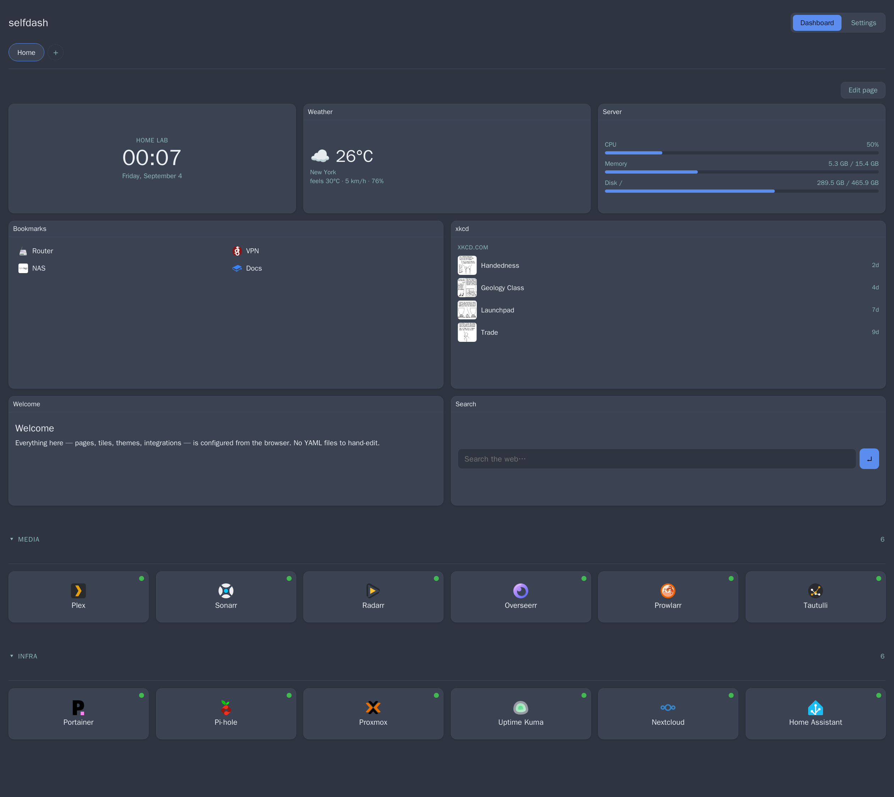
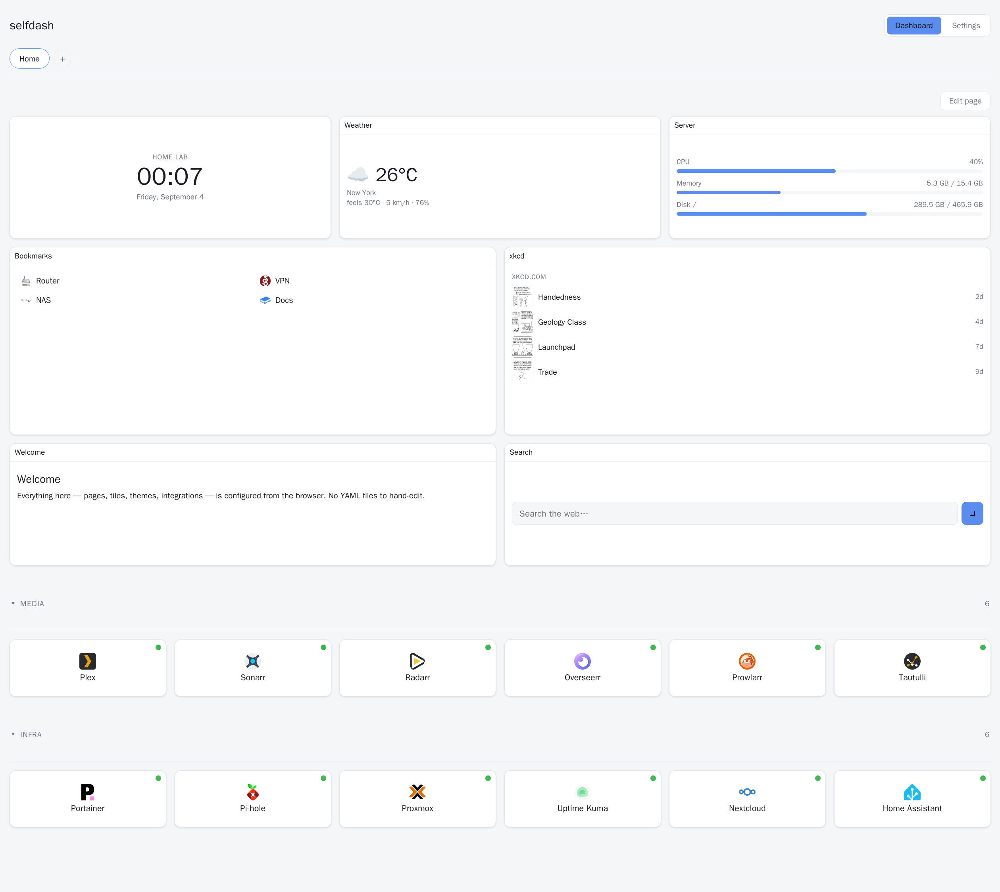

# selfdash

[](https://hub.docker.com/r/tstech0806/selfdash)
[](https://hub.docker.com/r/tstech0806/selfdash)
[](https://hub.docker.com/r/tstech0806/selfdash)
[](LICENSE)

A self-hosted "homepage" dashboard — a lighter-weight, more UI-customizable alternative to
Homepage / Homarr / Heimdall. Every bit of configuration (pages, tiles, themes, integrations)
is editable from the browser; nothing is YAML-file-driven. Config is persisted to SQLite +
uploaded assets under a single data directory, so the whole instance is portable via the built-in
backup/restore.



<details>
<summary>Light theme</summary>



</details>

Sample page shown — clock, weather, server stats, bookmarks, an RSS feed, notes, search, and
two groups of app-launcher tiles. None of it is fixed: tile types, layout, grouping, and theme
are all picked per page from the browser.

## Why selfdash

- **No YAML.** Pages, tiles, themes, and integrations are all configured by clicking around in
  the browser — nothing to hand-edit, indent correctly, or restart the container over.
- **12 tile types**, not just links: clock, weather, notes, search, RSS/Atom, an ICS calendar,
  bookmarks, a custom-API mapper, host resources (CPU/mem/disk/net), an iframe embed, plus a
  widget tile for any of the 53 built-in service integrations.
- **Portable by default.** Everything lives in one SQLite file plus an uploads folder — export
  a `.zip` (full backup) or a `.yaml` (version-controllable config, secrets kept out) and restore
  either onto a fresh container.
- **Drop-in integrations.** Add a new service by dropping a `*.integration.js` file into the data
  volume — no image rebuild, no core code changes. The five generic view types (`stats`,
  `nowplaying`, `queue`, `list`, `calendar`) mean the frontend needs zero changes for it either.
- **Actually light.** ~30-40 MB idle RSS, ~0% idle CPU, a ~240 MB image built from bare Alpine
  (not `node:22-alpine`) with no bundler or dev toolchain shipped at runtime.
- **8 built-in themes** (minimal, glass, terminal, gradient, nord, rosé pine, dracula, oled) ×
  light/dark/system, plus a free accent color and per-tile color overrides.

|  | selfdash | Homepage | Homarr | Heimdall |
|---|---|---|---|---|
| Configuration | In-browser | YAML files | In-browser | In-browser |
| Backup/restore | Built-in `.zip` + `.yaml` export | Manual (your YAML files) | Varies | Manual |
| Add an integration | Drop a JS file, no rebuild | Edit YAML / core code | Plugin system | Limited |
| Idle RSS | ~30-40 MB | Low | Higher (Next.js) | Low |

*(A fair comparison, not a takedown — Homepage's YAML model is a deliberate, well-executed
choice that suits a lot of setups better than a database-backed UI does.)*

## Quick start

Grab [`docker-compose.yml`](docker-compose.yml) (it pulls the prebuilt
[`tstech0806/selfdash`](https://hub.docker.com/r/tstech0806/selfdash) image — nothing is built
locally) and run:

```bash
docker compose up -d
```

Then open `http://localhost:3000`. That's it — a "Home" page is created automatically on first
boot. `docker compose down` stops it; your data stays in the `./data` directory next to
`docker-compose.yml` (a bind mount) — back that folder up and the instance moves with it.

The container starts as root only to fix ownership of `./data`, then drops to `PUID:PGID`
(default `1000:1000`). If the host user that owns your stack directory isn't uid 1000, set
`PUID`/`PGID` in `.env` (`id -u` / `id -g`).

Update to a newer image with:

```bash
docker compose pull && docker compose up -d
```

Prefer to run it without Docker for local development:

```bash
npm install
npm run build   # bundles the frontend into public/
npm run dev     # Fastify with --watch, serves on :3000, data in ./data/
```

## Building from source

The image on Docker Hub is built from the `Dockerfile` in this repo. To build it yourself:

```bash
docker build -t selfdash:local .
```

then point `docker-compose.yml` at `image: selfdash:local`.

> **BuildKit note:** in some environments `docker build` fails partway through `npm install`
> with `npm error Exit handler never called!` — the isolated BuildKit network namespace can't
> reach the npm registry. Give the build the host network stack: `docker build --network=host
> -t selfdash:local .` (or `DOCKER_BUILDKIT=0 docker build -t selfdash:local .`).

## Testing

Run the full-validation suite after every change:

```bash
npm test          # unit + API — ~10s, no network, no browser
npm run test:all  # + headless-browser smoke (needs Chrome; skips otherwise)
```

`npm test` boots the real server against throwaway SQLite DBs and exercises every
route, plus every pure helper in `src/shared` and `src/lib`. The case-by-case
catalog and the process for adding tests when you add a feature live in
[`TESTPLAN.md`](TESTPLAN.md); running details are in [`test/README.md`](test/README.md).

## Environment variables

| Var | Default | Purpose |
|---|---|---|
| `PORT` | `3000` | HTTP listen port |
| `DATA_DIR` | `/data` | SQLite DB, uploads, and runtime integrations live here |
| `APP_SECRET` | _(unset)_ | If set, encrypts stored integration credentials at rest (AES-256-GCM) |
| `LOG_LEVEL` | `info` | Fastify/pino logger level |
| `POLL_MIN_INTERVAL` | `15` | Safety floor (seconds) — no integration can be polled faster than this, regardless of its configured interval |
| `PUID` / `PGID` | `1000` | uid/gid the container chowns `DATA_DIR` to and runs as (Docker only) |

For `docker compose`, secrets live in a git-ignored `.env` file: `cp .env.example .env`,
then generate a value with `openssl rand -hex 32` and set `APP_SECRET`. Compose loads it
automatically (`env_file` in `docker-compose.yml`); the file is optional, so the stack still
comes up without it (integration config is then stored as plaintext).

Set `APP_SECRET` before you configure any integrations with real credentials — changing it
later won't re-encrypt anything already stored, and stored secrets become undecryptable if you
lose the value.

## Data directory layout

Everything under `DATA_DIR` (`/data` in the container, bind-mounted from `./data` on the host)
is what makes an instance portable:

```
/data
├── selfdash.db              # pages, tiles, settings, integration config/cache — everything
├── selfdash.db-wal          # SQLite WAL files, present when the db is open
├── selfdash.db-shm
├── uploads/                 # icons, backgrounds, favicons uploaded through the UI
└── integrations/            # drop a *.integration.js file here to add a new integration —
                              # no image rebuild needed (see "Writing an integration" below)
```

Back this whole directory up (or use the built-in export, see below) and you can restore the
entire instance — pages, tiles, theme, integrations and their credentials, uploaded assets —
onto a fresh container.

## Backup & restore

Settings → **Backup & restore**:

- **Export** downloads a `.zip` containing `selfdash.db`, everything in `uploads/` and
  `integrations/`, and a `manifest.json` listing it all. The db is WAL-checkpointed first so the
  copy is a consistent snapshot even while the server keeps running.
- **Import** uploads a `.zip` in the same shape and restores it. This **overwrites all current
  data** — the UI asks for confirmation. Before overwriting, the server snapshots the current
  `selfdash.db`/`uploads/`/`integrations/` into a timestamped `.pre-import-backup-<ts>/` folder
  inside the data volume (not deleted automatically — that's your manual undo if an import goes
  wrong). After swapping the files in, the server exits; `restart: unless-stopped` in
  `docker-compose.yml` brings it back up against the restored data through its normal boot
  sequence (migrations, integration registry, poller — all re-initialized fresh, same as any
  other container start).

### Configuration as YAML

Alongside the `.zip`, Settings → **Backup & restore** has **Export config (.yaml)** — a
human-readable snapshot of pages, tiles, integrations, and settings (no uploaded images).
It's for version control: commit it, `git diff` it, share it, reproduce an instance from it.

- Secrets (`password`-type fields — API keys, tokens) are written as
  `${SELFDASH_SECRET_<REF>_<FIELD>}` placeholders, never the real value.
- **Import config** replaces all pages/tiles/integrations/settings in one transaction
  (rolled back on any structural error; uploaded images untouched). Secret placeholders are
  read from the container's environment; anything unset imports blank and is reported so you
  can fill it in (Settings → Integrations) or add the env var and re-import. Widget tiles
  reference integrations by a stable `ref`, so ids don't have to line up.
- Also available over HTTP: `GET /api/config/export`, `POST /api/config/import` (a `.yaml`
  file upload, or a raw body with `Content-Type: application/yaml`; add `?settings=0` to
  leave settings alone).

## Docker Compose scan

Settings → **Docker Compose scan**. Point selfdash at a directory that contains one or more
compose stacks (searched recursively, `node_modules`/`.git`/hidden dirs skipped, bounded to 6
levels / 250 files / 512 KB per file) and the dashboard grows a panel listing, per container:

- every **published port** (`host → container`, with host IP and non-TCP protocol shown), plus
  `expose`-only internal ports
- every **volume** (`source → target`), tagged bind vs named, with `ro` flagged
- each stack's declared top-level named volumes

`compose.yaml` / `docker-compose.yml` and their `*.override.*` variants are recognised. `${VAR}`
references are resolved from a sibling `.env` file and from `${VAR:-default}` fallbacks; anything
still unresolved is shown literally so you can see it's environment-driven. Files that fail to
parse are listed at the bottom of the panel rather than failing the whole scan. Results are
cached ~15 s server-side; **Rescan** forces a fresh read.

**This feature only ever reads.** It never creates, edits, moves, or deletes a file — it
`readdir`/`stat`/`readFile`s compose files and parses them in memory, nothing else. A symlink
pointing outside the configured directory is not followed.

Running in Docker, the compose directory has to be visible **inside** the container. The shipped
`docker-compose.yml` bind-mounts `${COMPOSE_SCAN_DIR:-/compose-stacks}` read-only at the *same
path* inside the container; set `COMPOSE_SCAN_DIR` in `.env` to the absolute path of your stacks
directory and put that same path in Settings → **Docker Compose scan**. To mount it somewhere
else:

```yaml
    volumes:
      - ./data:/data
      - /opt/stacks:/stacks:ro      # <- your compose stacks
    # then set the path in Settings to: /stacks
```

The enable flag and directory path live in `settings` (so they're covered by backup/restore);
the compose files themselves are external and are not backed up.

## Host resources tile

The **Host resources** tile shows CPU, memory, one bar per configured **drive**, and one row
per configured **network interface** (leave the interface list empty to auto-pick the busiest).

Running in Docker it reads `/proc`. By default that's the *container's* `/proc`, which is fine
for CPU/memory but shows only the container's own filesystem and `eth0`. To report the host:

```yaml
    volumes:
      - /proc:/host/proc:ro                 # host CPU / memory / disk
      - /mnt/media:/host/mnt/media:ro        # any extra drive you want in the tile
    pid: host                               # host network interfaces (per-interface stats)
```

Then use the in-container paths (`/host/mnt/media`, …) in the tile's drive list. `pid: host`
is only needed for real host network stats — `/proc/net/*` is network-namespace scoped, so the
tile reads pid 1's view (`/host/proc/1/net/dev`) when the PID namespace is shared.

## Writing an integration

Drop a file matching `*.integration.js` into `DATA_DIR/integrations/` (e.g.
`/data/integrations/myservice.integration.js` inside the container, or the corresponding path on
your bind-mounted/named volume) and restart the container — no image rebuild, no core code
changes. It's picked up automatically. A file in the runtime folder with the same `key` as one of
the built-in integrations overrides it, so you can patch a shipped integration too.

```js
export default class MyServiceIntegration {
  static key = 'myservice';               // unique, used as the DB/API identifier
  static title = 'My Service';            // shown in the "add integration" list
  static defaultInterval = 60;            // seconds; still floored by POLL_MIN_INTERVAL
  static configSchema = {
    fields: [
      { name: 'url',    label: 'Server URL', type: 'url',      required: true },
      { name: 'apiKey', label: 'API Key',    type: 'password', required: true },
    ],
  };

  async fetchData({ config, http }) {
    // `http` is a shared client with a per-host concurrency cap and a request timeout —
    // use it instead of the global fetch so your integration plays nicely with others
    // hitting the same host.
    const data = await http.fetchJson(`${config.url}/api/status`, {
      headers: { 'X-Api-Key': config.apiKey },
    });

    // Throwing here is the correct way to signal failure — the scheduler catches it,
    // marks the integration "unreachable", records the error, and (importantly) leaves
    // the last successfully-fetched data in place so the UI doesn't blank out.
    if (!data.ok) throw new Error('service reported not-ok status');

    // Must return one of five normalized shapes — the frontend has one generic
    // renderer per type, so a new integration needs zero frontend changes.
    return {
      type: 'stats', // 'stats' | 'nowplaying' | 'queue' | 'list' | 'calendar'
      items: [{ label: 'Status', value: 'OK' }],
    };
  }
}
```

`configSchema.fields` is auto-rendered into a form in the Integrations panel — no bespoke UI per
integration. Field `type`s: `text`, `url`, `password`, `number`, `checkbox`, `select` (single,
`options: [{value,label}]`), and `multiselect` (checkbox group, value is an array). `type: 'password'`
fields are never sent back to the frontend in plaintext (only whether one is set); leaving one
blank when editing keeps the existing stored value.

### Multiple views, and which one(s) a tile shows

An integration that can show more than one thing (queue *and* library stats, say) uses the
`_views.js` helper. Declare a `views` map and always fetch every one of them, every poll:

```js
import { runAllViews } from './_views.js';

const VIEWS = {
  queue: { label: 'Download queue', run: (ctx) => fetchQueue(ctx) },
  stats: { label: 'Library stats',  run: (ctx) => fetchStats(ctx) },
};

static views = Object.fromEntries(Object.entries(VIEWS).map(([k, v]) => [k, v.label]));
static configSchema = { fields: [ /* url, apiKey, */ ] };

async fetchData(ctx) {
  return runAllViews(ctx, VIEWS);
}
```

`fetchData` always returns `{ type: 'multi', byView: { <viewKey>: WidgetModel } }` — the
integration doesn't decide what's displayed, it just keeps every view's data fresh. **Which**
view(s) a tile shows is a property of the *tile*, not the integration (`tile.config.views`, set
in the tile's edit modal via `static views`'s catalog) — so two tiles pointed at the same
integration can each show something different. Static `views` is also what makes an
integration "mergeable": a tile can pick a single view and, if another integration exposes a
view with that same key (`tile.config.moreIntegrationIds`), combine both into one tile — e.g. one
calendar showing releases from two Radarr instances, or all Radarr + Sonarr calendars together.
`calendar`/`list`/`queue` views merge their `items`; `stats`/`nowplaying` fall back to one section
per source since there's no sane way to merge a single number or now-playing card. See
`mergeModel` in `web/components/WidgetTile.jsx`. If every view in `byView` failed, `runAllViews`
throws so the tile keeps its last good data; a view that fails on its own becomes
`{ type: 'error', error }` in its own slot instead of taking the rest down with it.

The six `WidgetModel` shapes, and what each `items[]` entry looks like:

| `type` | `items[]` shape | Used by |
|---|---|---|
| `stats` | `{ label, value }` | Audiobookshelf, Plex, Jellyfin, Emby, Tautulli, Bazarr, Pi-hole, AdGuard, Portainer, Traefik, NPM, Transmission, Deluge, NZBGet, Tdarr, What's Up Docker, Uptime Kuma, Gatus, Healthchecks, Grafana, Speedtest Tracker, Scrutiny, Prometheus, Navidrome, Paperless-ngx, Komga, Kavita, Miniflux, FreshRSS, Gotify, Frigate, Mastodon, RomM, Vikunja, *arr library stats |
| `nowplaying` | `{ title, subtitle?, image?, progress? }` (0-1) | Plex, Jellyfin, Emby, Tautulli (active sessions), Navidrome (active streams) |
| `queue` | `{ title, status?, progress? }` (0-1) | qBittorrent, SABnzbd, Radarr, Sonarr, Readarr, Lidarr, Transmission, Deluge, NZBGet, Tautulli streams |
| `list` | `{ title, subtitle?, image? }` | *arr upcoming, Bazarr wanted / history, AdGuard top-blocked, Portainer stopped/unhealthy, NPM expiring certs, Tdarr staged/errored, What's Up Docker updates, Grafana firing alerts, Prometheus down targets, Paperless-ngx inbox, Gotify / ntfy messages, Vikunja tasks due, Frigate events, Tautulli history, Bookdrop |
| `calendar` | `{ ts, title, subtitle? }` (`ts` = epoch ms; bucketed by local day, rendered one month at a time with ‹ › navigation) | Radarr / Sonarr / Lidarr release calendar |
| `status` | `{ label, state: 'up'\|'down'\|'warn'\|'paused', detail? }` (rendered as a colored dot per row) | Uptime Kuma / Gatus / Healthchecks monitor boards, Scrutiny drive health |

Fifty-three integrations ship out of the box (`src/integrations/*.integration.js`):

- **Downloads** — qBittorrent, SABnzbd, Transmission, Deluge, NZBGet
- **Media servers** — Plex, Jellyfin, Emby, Tautulli, Audiobookshelf
- **Media management / *arr** — Radarr, Sonarr, Lidarr, Readarr, Prowlarr, Bazarr (subtitles)
- **Music / books / comics** — Navidrome, Komga, Kavita
- **Monitoring / status** — Uptime Kuma, Gatus, Healthchecks, Grafana, Speedtest Tracker, Scrutiny (SMART disk health), Prometheus
- **Requests** — Overseerr, Jellyseerr (also works with seerr)
- **Network / infra** — Pi-hole, AdGuard Home, Portainer, Traefik, Nginx Proxy Manager, UniFi Network
- **NAS / virtualization / home automation** — Proxmox VE, TrueNAS, Home Assistant, Nextcloud, Frigate (NVR)
- **Notifications / feeds** — Gotify, ntfy, Miniflux, FreshRSS
- **Productivity / docs** — Paperless-ngx, Vikunja
- **Transcoding / container hygiene** — Tdarr, What's Up Docker
- **Other self-hosted** — Immich (photos), Mealie (recipes), Gluetun (VPN control server), Bookdrop (upcoming audiobook releases), Mastodon (instance stats), RomM (retro-game library)

They were built and validated against documented API shapes plus a mock-HTTP-server test suite.
Forty-two of the fifty-three — qBittorrent, SABnzbd, Radarr, Sonarr, Plex, Audiobookshelf, Transmission,
Deluge, NZBGet, Tdarr, Lidarr, Bazarr, Jellyfin, Emby, Jellyseerr, Pi-hole, AdGuard Home,
Portainer, Traefik, Nginx Proxy Manager, What's Up Docker, Uptime Kuma, Gatus, Healthchecks,
Grafana, Speedtest Tracker, Scrutiny, Home Assistant, Nextcloud, UniFi Network, Navidrome,
Paperless-ngx, Komga, Kavita, Miniflux, FreshRSS, Gotify, ntfy, Vikunja, Frigate, Prometheus,
and RomM — have also been confirmed against live instances (spun up with `docker run`, driven
through real setup wizards and real data, then torn down); Mastodon's instance-stats endpoint
was checked read-only against the live `mastodon.social` API. Proxmox VE and TrueNAS are the two
exceptions to that process, for a structural reason rather than lack of effort: neither ships a
Docker image — they're full hypervisor/NAS operating systems, not container workloads — so
there's no lightweight way to stand one up for testing here. The rest (Readarr, Prowlarr,
Overseerr, Immich, Mealie, Gluetun, Bookdrop, Proxmox VE, TrueNAS) are a solid first draft
built from documented API shapes, not yet exercised live. Endpoint paths and field names vary
by app version, so treat any integration here as "correct against the version tested," not as
guaranteed forever.

Several integrations had real, live-verified gotchas worth knowing about:

- **Tdarr** has no documented public REST API — everything goes through one generic CRUD
  endpoint (`POST /api/v2/cruddb`) over its internal LokiJS collections, plus
  `GET /api/v2/get-nodes` for live worker state — so its shape was reverse-engineered against a
  real `haveagitgat/tdarr` container rather than docs: `cruddb`'s `mode` only accepts
  `getById`/`getByIndex`/`getAll`/`insert`/`update`/`removeOne`/`removeAll`/`getCount` (no
  `find`), and `TranscodeDecisionMaker` values are Title Case (`"Queued"`, `"Transcode error"`,
  `"Transcode success"`, `"Not required"`), not lowercase.
- **Deluge**'s web UI process starts out **disconnected** from the daemon (after a restart, or
  on an install that's never been opened in a browser) — `web.update_ui` doesn't error in that
  state, it just returns `torrents: null`, which would otherwise look exactly like "no torrents"
  forever. The integration detects `connected: false` and calls `web.connect` on the first
  configured host itself.
- **Speedtest Tracker**'s real API has no `/api/v1` prefix and no history endpoint at all — the
  only route is `GET /api/speedtest/latest`. The originally-planned "24h average" stat was
  dropped entirely rather than shipped as a fallback that silently just repeats the latest
  reading forever.
- **Scrutiny**'s per-device map is nested one level deeper than it looks —
  `{ data: { summary: { <wwn>: {...} } } }`, not `{ data: { <wwn>: {...} } }` — easy to miss
  since `data` is a plain object either way. Getting this wrong doesn't error, it just returns
  one bogus "device" (the whole summary map, mistaken for a single entry) instead of the real
  ones.
- **Vikunja**'s "all tasks" list endpoint is `GET /api/v1/tasks` — **not** `/api/v1/tasks/all`,
  which 400s `Invalid model provided` on current Vikunja (v2.6). An API token (`tk_…`) also
  needs the `tasks: read_all` permission scope, or the same route 401s.
- **FreshRSS**'s Google Reader API is off until `api_enabled` is set in `data/config.php` (it's
  a global toggle, not the per-user API password), and the `ClientLogin` `Auth=` token itself
  contains a `/` — pass it through verbatim.
- **Kavita**'s `/api/Stats/user/read` returns an empty `200` body until the user has some
  reading progress; "Words read" reads as 0 until then.

**Portainer**'s Docker-proxy fallback (`GET /api/endpoints/{id}/docker/containers/json`) turned
out to be the *common* path, not a rare edge case — the snapshot's `DockerSnapshotRaw.Containers`
was absent on the version tested (2.45.0), so every `down`-view poll exercises that fallback.

Proxmox VE, TrueNAS, Home Assistant, Nextcloud, and UniFi Network can surface an **"Allow
self-signed / insecure TLS certificate"** checkbox in their config — appliance-style targets
like these usually ship a self-signed cert out of the box. Verified against a real self-signed
handshake, not just a mock: `HttpClient` rejects an unverified cert by default and only accepts
one when that box is checked (`test/unit/lib.httpClient.test.mjs`, and — live — against UniFi
Network's own default cert).

## Theming

Settings → pick a theme (**minimal**, **glass**, **terminal**, **gradient**, **nord**,
**rosé pine**, **dracula**, **oled**) and an appearance mode (**light** / **dark** / **system**).
Every theme defines both a light and dark token set;
`system` resolves via `prefers-color-scheme` in the browser and updates live if the OS setting
changes while the tab is open. The accent color is a single CSS variable (`--accent`) layered on
top of whichever theme is active, so any theme + any accent combination works.

Themes are plain CSS custom properties in `web/style.css`, scoped under
`[data-theme="..."][data-mode="..."]` selectors — adding a new theme is a CSS-only change, no
JS required.

## Architecture

- **Backend**: Fastify + `node:sqlite` (Node's built-in SQLite binding — no native module to
  cross-compile between the Docker build and runtime stages). Runs behind a single `preHandler`
  hook point reserved for future auth (there is no auth in v1 by design — anyone who can reach
  the instance can configure it).
- **Frontend**: Preact + `@preact/signals` for state, bundled by esbuild *only* during
  `docker build` — the runtime image ships static files and has no bundler or dev toolchain in
  it. Drag-to-reorder tiles use SortableJS.
- **Integrations**: `src/integrations/_base.js` (`BaseIntegration`) + `_registry.js` (loads
  `*.integration.js` from both the shipped directory and `DATA_DIR/integrations` at boot).
  `src/poller/scheduler.js` runs one `setInterval` per *enabled* integration, in-process — no
  extra worker, no Redis. `src/integrations/configCodec.js` is the single place that
  encrypts/decrypts/masks/validates integration config, shared by the routes and the poller so
  that logic can't drift apart between the two call sites.
- **Storage**: one SQLite file (WAL mode) holds pages, tiles, settings, and integration
  config/cache. Uploaded assets (icons, backgrounds, favicons) live as plain files under
  `DATA_DIR/uploads`, served by a second, separately-rooted `@fastify/static` registration.

### Why these choices (trade-offs, not defaults)

- **`node:sqlite` over `better-sqlite3`** — no native module means the build and runtime Docker
  stages can't break on an ABI mismatch. Cost: `node:sqlite` is still experimental in Node 22 (the
  `--experimental-sqlite` flag plus `--disable-warning=ExperimentalWarning` are baked into the
  `npm start`/`dev` scripts and the Dockerfile `CMD` to make this invisible in normal operation).
- **Fastify over a compiled-binary backend** — costs a bit of idle RSS (see below) versus, say,
  Go, but buys runtime-loadable integration files: dropping a `.js` file into the data volume is
  enough, no recompiling or rebuilding the image.
- **In-process poller over a separate worker/cron process** — one `setInterval` per enabled
  integration is simple to reason about and cheap enough for a personal dashboard's integration
  count; there's no case here for the operational overhead of a second process or a queue.
- **CSS Grid + SortableJS over a free-form pixel-grid drag library** — tile positions are S/M/L/
  wide presets on a fixed-column grid, not arbitrary x/y coordinates. Free-form grids are a common
  performance sink in comparable dashboards; this sidesteps that entirely.

## Idle resource usage

Measured with `docker stats` — Fastify + the frontend served + the integration registry loaded
(all built-in integrations) but zero integrations actually configured/polling:

- **Idle RSS: ~30-40 MB** (well under the ~55-80 MB original estimate and the 100 MB target)
- **Idle CPU: ~0%** (timer-driven only — nothing polls unless an integration is configured and
  enabled)
- **Docker image size: ~240 MB.** The runtime stage isn't `node:22-alpine` itself — it's bare
  Alpine plus just the Node binary (build/deps stages still use `node:22-alpine` to install
  dependencies and run esbuild, but npm/corepack/yarn/headers never make it into the final image,
  since nothing needs them after build time). Down from ~290 MB before that split.

Each additional *enabled* integration adds one lightweight timer plus whatever memory its last
cached JSON response occupies — not meaningfully measured individually here, but bounded by
design (no per-integration process, no unbounded cache growth).

## Project status

Actively developed — see [`TESTPLAN.md`](TESTPLAN.md) for the full case-by-case catalog. Every
change ships behind the automated suite (unit + API + a headless-browser smoke test) plus a
manual click-through checklist for anything touching layout or interaction; nothing merges
without both. Forty-two of the fifty-three built-in integrations have also been confirmed
against live instances (see the Integrations section above for the full list and its
live-verified gotchas) — the rest are a solid first draft built from documented API shapes, not
yet exercised against every real-world version/config quirk.

There is intentionally **no auth in v1** (see Architecture below) — put it behind a reverse
proxy or VPN if it's reachable from anywhere you don't fully trust.
